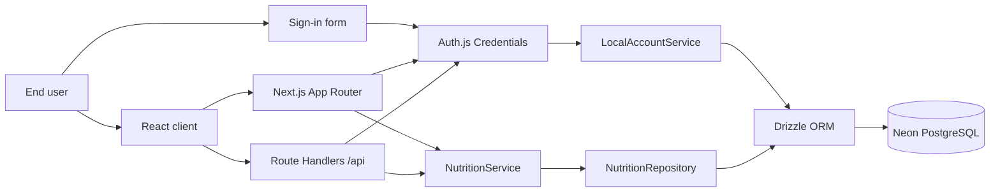

# Nutribro Architecture

## Goal and scope

Nutribro allows each user to organize reusable recipes and a single recurring weekly menu of seven days by five meals. Each meal can group one or more ordered recipes. An initial recipe library is copied for each local account when the user signs up. Product data is stored in an isolated per-account structure in PostgreSQL.

The following are out of scope: nutritional calculations, recommendations, AI generation, and shopping lists.

## Container view

- Server pages fetch the session and initial data.
- Client components handle navigation, theming, forms, and mutations against same-origin APIs.
- Auth.js validates the signed JWT session; the service enforces ownership authorization.
- `NutritionRepository` always receives a `userId`, so it never hydrates data for other users.

## Layers and responsibilities

| Layer | Location | Responsibility |
| --- | --- | --- |
| Presentation | `src/app`, `src/components`, `src/lib` | UI, interaction, and DTO consumption. It does not access sessions or the database directly. |
| Domain | `src/domain/nutrition` | Types, calendar logic, historical factories, and Zod validation. It has no dependency on Next.js. |
| Application | `src/server/services` | Use cases, ownership rules, DTOs, and input validation. |
| Persistence | `src/server/infrastructure/database`, `postgres-nutrition-repository.ts` | Drizzle schema, Neon client, and aggregation hydration/synchronization per user. |
| HTTP delivery | `src/app/api`, `src/server/http` | Origin checks, body limits, and error-to-JSON response mapping. |
| Identity | `src/auth.ts`, `src/server/auth`, `src/server/services/local-account-service.ts` | Local credentials, Argon2id hashing, JWT session, and secure identity data for the UI. |

## Mutation flow

1. The UI sends JSON to a same-origin Route Handler.
2. The endpoint checks origin, type, and body size, and requires a valid session.
3. `NutritionService` validates the input with Zod and verifies that the recipe, plan, and slot belong to the session `userId`.
4. `PostgresNutritionRepository` ensures the user has a 35-slot plan, hydrates only their aggregate, and applies the service mutator on a copy.
5. Domain invariants are validated and Drizzle synchronizes recipes, ingredients, plan, slots, and ordered assignments through a Neon transactional HTTP batch.
6. The endpoint returns a minimal DTO or a structured error; it never leaks password hashes or data from another account.

## Architectural decisions (ADRs)

### ADR-001 — Next.js App Router as a lightweight BFF

**Decision:** a single Next.js application with server pages, client components, and Route Handlers.

**Why:** it keeps secrets and data access on the server, reduces deployment complexity, and preserves a clear HTTP boundary for future integrations.

### ADR-002 — Neon PostgreSQL and Drizzle ORM

**Decision:** use Neon as the managed PostgreSQL service and Drizzle for the schema, queries, and versioned SQL migrations in [drizzle](../drizzle).

**Why:** Vercel does not offer persistent local storage for serverless functions. Neon provides a suitable HTTP connection for that environment, and Drizzle keeps the model typed without coupling the UI to SQL.

`JsonNutritionRepository` remains as a legacy adapter for reading the migration source; production composition uses `PostgresNutritionRepository`.

### ADR-003 — Local credentials with Argon2id and JWT sessions

**Decision:** Auth.js v5 uses the `Credentials` provider for email and password. Hashes are generated with Argon2id and the session is `jwt`.

**Why:** it allows local account management to be validated without configuring an OAuth provider. Auth.js requires JWT when Credentials is the only provider; the signed cookie contains the session identity, not the password or its hash. Account data and the hash live in PostgreSQL, separated into `users` and `user_credentials`.

`LocalAccountService` validates input with Zod, normalizes the email, creates Argon2id hashes, and compares cost parameters even for nonexistent addresses. Authentication routes live under `/api/auth/[...nextauth]`; if `DATABASE_URL` or `AUTH_SECRET` are missing, the sign-in screen explains the required configuration and the APIs do not fall back to the shared legacy store.

The `auth_accounts`, `auth_sessions`, and `auth_verification_tokens` tables are preserved for a future addition of OAuth or magic links, but sessions in this phase are not stored in `auth_sessions`.

### ADR-004 — User-scoped menu aggregate

**Decision:** keep the service based on the `StoreData` aggregate, but change the port to `ensureWorkspace(userId)`, `read(userId)`, and `update(userId, mutator)`.

**Why:** it reduces migration effort for existing use cases and avoids loading all tenants. Each first session creates an empty `repeating` plan with the 35 stable `MealSlot` records. PostgreSQL provides foreign keys, cascades, indexes, and uniqueness in addition to Zod validation.

### ADR-005 — Repeating plan with slots and ordered recipes

**Decision:** a `WeeklyPlan` per user with `repeating` mode, 35 `MealSlot` entries identified by day and meal, and a `meal_slot_recipe_assignments` table for the recipes in each slot.

**Why:** it represents the current rule without artificial dates and allows combining, for example, a main dish and a side dish in the same meal. A unique constraint on `(weekly_plan_id, day, meal)` and a primary key on `(weekly_plan_id, id)` prevent duplicate slots; the assignment key prevents repeating the same recipe within a slot and its position preserves a stable display order.

### ADR-006 — Explicit DTOs and boundary validation

**Decision:** endpoints return summaries, details, or board data; every JSON body is validated on the server.

**Why:** it prevents accidental exposure of Auth.js fields and keeps contracts stable even if the schema changes.

### ADR-007 — Versioned private starter library

**Decision:** the 21 recipes extracted from the plan remain as versioned domain templates and are copied into the account creation transaction for each account. `user_default_recipe_libraries` records the version received by each user.

**Why:** recipes still carry `ownerId`, so a user can edit or delete them without affecting anyone else. The flag prevents duplicates when the library is explicitly added to an existing account. Unfinished document portions are not modeled as recipes because the domain requires ingredients and instructions.

## Applied security

- `AUTH_SECRET` and `DATABASE_URL` remain server-only variables; there are no `NEXT_PUBLIC_` secrets.
- All product routes require an authenticated identity. Requests without a session return `401`; incomplete installations return `503` without falling back to the fixed MVP user.
- Ownership checks live in `NutritionService`, not only in navigation or UI code.
- Passwords are stored exclusively as Argon2id hashes using server-defined cost parameters; they are never logged, returned, or serialized to the client.
- The `user_credentials` table has a one-to-one relationship and cascade delete with `users`.
- The starter library is inserted alongside the account and credentials. `user_default_recipe_libraries` keeps a per-user version marker to prevent accidental second copies.
- Zod validates JSON, UUIDs, lengths, ingredients, and HTTPS URLs; Route Handlers limit payload size and check same-origin requests for mutations.
- CSP, anti-frame settings, `nosniff`, referrer policy, and permission policy are maintained in the Next.js configuration.
- Database and identity modules are server-only via `server-only`.

## Legacy data and migration

Local JSON files are preserved as the source until an explicit import is completed. `scripts/import-json.ts` requires:

1. A destination account already created through the sign-up form.
2. `NUTRITION_IMPORT_USER_ID` with that account's UUID.
3. `NUTRITION_IMPORT_CONFIRM=replace` to acknowledge that it will replace that account's menu and recipes.

The script remaps recipe and ingredient UUIDs before inserting them, so it cannot overwrite other users' data via key collisions. The demo JSON uses ordered `recipeIds`; the reader keeps compatibility with the historical `recipeId` field and normalizes it during import. New standard records do not receive the demo recipes.

The migration `0004_gigantic_joystick` creates per-slot assignments, copies each existing `meal_slots.recipe_id` as a position-zero assignment, and removes the legacy column after preserving its data.

## Planned extension

### Roles and account management

Add persistent roles or a membership table only when there is a concrete need to share spaces. The current owner checks should remain as the resource-level data defense.

### Nutrition and goals

Create `IngredientCatalogItem`, `NutritionProfile`, `NutritionGoal`, and normalized amounts without altering the original textual representation of ingredients.

### Date-based plans

Add ISO week plans or dated overrides. Resolution should prefer the specific plan and then the base repeating plan.

## Deployment strategy

Public delivery uses GitHub as the source, Vercel for Next.js, and Neon as the persistent storage. Production, Preview, and development should use separate Neon connections and `AUTH_SECRET` values. Vercel receives only `DATABASE_URL` and `AUTH_SECRET` as server secrets; the app does not require `AUTH_URL`, `NEXTAUTH_URL`, or public variables for Auth.js.

Drizzle migrations run explicitly against Neon before a release depending on them receives traffic. They are not part of the Vercel build: this prevents a migration failure from leaving the application partially deployed. The first production environment starts empty; sign-up provisions the starter recipes and plan without importing the development JSON files.

Before publishing the credentials form, a Vercel Firewall rule limits `POST` requests for sign-in and sign-up by IP. The rule is validated in Preview via logs and then published with a `429` response when the threshold is exceeded. This protects the HTTP edge; a future phase can add per-account limits and automated tests.

The `Dockerfile` remains available for development or alternative hosting, but it does not bundle or contain product data: it also depends on external PostgreSQL. The full operational procedure is in [docs/deployment.md](deployment.md).
