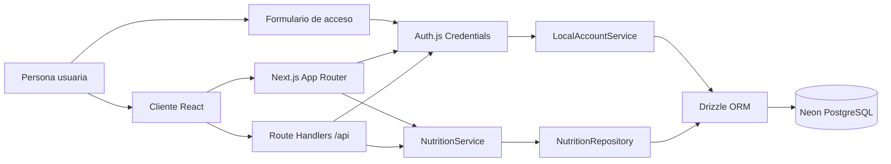

# Arquitectura de Nutribro

## Objetivo y límites

Nutribro permite a cada persona usuaria organizar recetas reutilizables y un único menú semanal recurrente de siete días por cinco comidas. Cada comida puede agrupar una o más recetas ordenadas. Una biblioteca inicial de recetas se copia para cada cuenta local al registrarse. Los datos de producto se almacenan de forma aislada por cuenta en PostgreSQL.

Quedan fuera del alcance cálculos nutricionales, recomendaciones, generación con IA y lista de la compra.

## Vista de contenedores

- Las páginas de servidor recuperan la sesión y los datos iniciales.
- Los componentes cliente manejan navegación, tema, formularios y mutaciones contra las API del mismo origen.
- Auth.js valida la sesión JWT firmada; el servicio mantiene la autorización por propietario.
- `NutritionRepository` recibe siempre un `userId`, por lo que nunca hidrata datos de otros usuarios.

## Capas y responsabilidades

| Capa | Ubicación | Responsabilidad |
| --- | --- | --- |
| Presentación | `src/app`, `src/components`, `src/lib` | UI, interacción y consumo de DTOs. No accede a sesiones ni base de datos directamente. |
| Dominio | `src/domain/nutrition` | Tipos, calendario, fábricas históricas y validación Zod. No depende de Next.js. |
| Aplicación | `src/server/services` | Casos de uso, reglas de propiedad, DTOs y validación de entrada. |
| Persistencia | `src/server/infrastructure/database`, `postgres-nutrition-repository.ts` | Esquema Drizzle, cliente Neon e hidratación/sincronización del agregado por usuario. |
| Entrega HTTP | `src/app/api`, `src/server/http` | Control de origen, límites de cuerpo y mapeo de errores a respuestas JSON. |
| Identidad | `src/auth.ts`, `src/server/auth`, `src/server/services/local-account-service.ts` | Credenciales locales, hash Argon2id, sesión JWT y datos de identidad seguros para la UI. |

## Flujo de una mutación

1. La UI envía JSON a un Route Handler del mismo origen.
2. El endpoint comprueba origen, tipo y tamaño del cuerpo, y exige una sesión válida.
3. `NutritionService` valida la entrada con Zod y comprueba que receta, plan y hueco pertenecen al `userId` de la sesión.
4. `PostgresNutritionRepository` asegura que el usuario tenga su plan de 35 huecos, hidrata solo su agregado y aplica el mutador del servicio sobre una copia.
5. Se validan invariantes de dominio y Drizzle sincroniza recetas, ingredientes, plan, huecos y asignaciones ordenadas mediante un lote transaccional HTTP de Neon.
6. El endpoint devuelve un DTO mínimo o un error estructurado; nunca hashes de contraseña ni datos de otra cuenta.

## Decisiones arquitectónicas (ADRs)

### ADR-001 — Next.js App Router como BFF ligero

**Decisión:** una única aplicación Next.js con páginas de servidor, componentes cliente y Route Handlers.

**Por qué:** protege secretos y acceso a datos en el servidor, reduce despliegues y conserva un borde HTTP claro para futuras integraciones.

### ADR-002 — Neon PostgreSQL y Drizzle ORM

**Decisión:** usar Neon como PostgreSQL gestionado y Drizzle para el esquema, las consultas y las migraciones SQL versionadas en [drizzle](../drizzle).

**Por qué:** Vercel no ofrece almacenamiento local persistente a funciones serverless. Neon permite una conexión HTTP adecuada para ese entorno y Drizzle mantiene el modelo tipado sin acoplar la UI a SQL.

`JsonNutritionRepository` queda como adaptador heredado para leer el origen de migración; la composición de producción usa `PostgresNutritionRepository`.

### ADR-003 — Credenciales locales con Argon2id y sesiones JWT

**Decisión:** Auth.js v5 usa el proveedor `Credentials` para email y contraseña. Los hashes se calculan con Argon2id y la sesión es `jwt`.

**Por qué:** permite validar toda la gestión de cuentas en localhost sin configurar un proveedor OAuth. Auth.js requiere JWT cuando Credentials es el único proveedor; la cookie firmada contiene la identidad de sesión, no la contraseña ni su hash. Los datos de cuenta y el hash viven en PostgreSQL, separados en `users` y `user_credentials`.

`LocalAccountService` valida entrada con Zod, normaliza el email, crea hashes Argon2id y compara el coste también para correos inexistentes. Las rutas de autenticación viven en `/api/auth/[...nextauth]`; si faltan `DATABASE_URL` o `AUTH_SECRET`, la pantalla de acceso explica la configuración requerida y las APIs no recurren al almacén heredado compartido.

Las tablas `auth_accounts`, `auth_sessions` y `auth_verification_tokens` se conservan para una futura incorporación de OAuth o enlaces mágicos, pero las sesiones de esta fase no se almacenan en `auth_sessions`.

### ADR-004 — Agregado de menú con ámbito de usuario

**Decisión:** conservar el servicio basado en el agregado `StoreData`, pero cambiar el puerto a `ensureWorkspace(userId)`, `read(userId)` y `update(userId, mutator)`.

**Por qué:** reduce la migración de los casos de uso existentes y evita cargar todos los tenants. Cada primera sesión crea un plan `repeating` vacío con los 35 `MealSlot` estables. PostgreSQL aporta claves foráneas, cascadas, índices y unicidad además de la validación Zod.

### ADR-005 — Plan repetitivo con huecos y recetas ordenadas

**Decisión:** un `WeeklyPlan` `repeating` por usuario, 35 `MealSlot` identificados por día y comida, y una tabla `meal_slot_recipe_assignments` para las recetas de cada hueco.

**Por qué:** representa la regla actual sin fechas artificiales y permite combinar, por ejemplo, un plato principal y un acompañamiento en la misma comida. Una restricción única por `(weekly_plan_id, day, meal)` y una clave primaria por `(weekly_plan_id, id)` impiden huecos duplicados; la clave de asignación impide repetir una receta dentro de un hueco y su posición conserva un orden estable de presentación.

### ADR-006 — DTOs explícitos y validación en frontera

**Decisión:** los endpoints devuelven resúmenes, detalles o tablero; todo cuerpo JSON se valida en el servidor.

**Por qué:** evita exposición accidental de campos de Auth.js y hace los contratos estables frente a cambios de esquema.

### ADR-007 — Biblioteca inicial versionada y privada

**Decisión:** las 21 recetas extraídas del plan se mantienen como plantillas versionadas de dominio y se copian en la transacción de alta de cada cuenta. `user_default_recipe_libraries` registra la versión recibida por usuario.

**Por qué:** las recetas siguen teniendo `ownerId`, por lo que una persona puede editarlas o borrarlas sin afectar a nadie más. La marca impide duplicados al añadir la biblioteca de forma explícita a una cuenta existente. Las porciones sin elaboración del documento no se modelan como recetas porque el dominio exige ingredientes e instrucciones.

## Seguridad aplicada

- `AUTH_SECRET` y `DATABASE_URL` permanecen solo en variables de servidor; no hay secretos `NEXT_PUBLIC_`.
- Todas las rutas de producto requieren identidad autenticada. Un acceso sin sesión devuelve `401`; una instalación incompleta devuelve `503` sin recurrir al usuario fijo del MVP.
- La comprobación de propiedad reside en `NutritionService`, no solo en la navegación o en la UI.
- Las contraseñas se guardan exclusivamente como hashes Argon2id con parámetros de coste definidos en servidor; nunca se registran, devuelven o serializan al cliente.
- La tabla `user_credentials` tiene una relación uno a uno y borrado en cascada con `users`.
- La biblioteca inicial se inserta junto con la cuenta y sus credenciales. `user_default_recipe_libraries` conserva una marca de versión por usuario para impedir una segunda copia accidental.
- Zod valida JSON, UUID, longitudes, ingredientes y URL HTTPS; los Route Handlers limitan el tamaño de carga y comprueban el mismo origen para mutaciones.
- CSP, anti-frame, `nosniff`, política de referentes y de permisos se mantienen en la configuración de Next.js.
- Los módulos de base de datos e identidad son solo de servidor mediante `server-only`.

## Datos heredados y migración

Los JSON locales se preservan como origen hasta completar una importación explícita. `scripts/import-json.ts` exige:

1. Una cuenta destino ya creada mediante el formulario de registro.
2. `NUTRITION_IMPORT_USER_ID` con su UUID.
3. `NUTRITION_IMPORT_CONFIRM=replace` para reconocer que reemplazará el menú y las recetas de esa cuenta.

El script remapea UUID de recetas e ingredientes antes de insertarlos, por lo que no puede sobrescribir datos de otros usuarios por colisión de claves. El JSON demo usa `recipeIds` ordenados; el lector conserva compatibilidad con el campo histórico `recipeId` y lo normaliza durante la importación. Los nuevos registros normales no reciben las recetas demo.

La migración `0004_gigantic_joystick` crea las asignaciones por hueco, copia cada `meal_slots.recipe_id` existente como una asignación de posición cero y elimina la columna heredada después de conservar sus datos.

## Extensión prevista

### Roles y gestión de cuenta

Añadir roles persistentes o una tabla de membresías solo cuando exista una necesidad de compartir espacios. Las comprobaciones de propietario actuales deben mantenerse como defensa de datos por recurso.

### Nutrición y objetivos

Crear `IngredientCatalogItem`, `NutritionProfile`, `NutritionGoal` y cantidades normalizadas sin alterar la representación textual original de ingredientes.

### Planes por fecha

Añadir planes de semana ISO u overrides fechados. La resolución debe preferir el plan específico y después el plan recurrente base.

## Estrategia de despliegue

La entrega pública usa GitHub como origen, Vercel para Next.js y Neon como almacenamiento persistente. Producción, Preview y desarrollo deben usar conexiones de Neon y `AUTH_SECRET` independientes. Vercel recibe únicamente `DATABASE_URL` y `AUTH_SECRET` como secretos de servidor; el código no requiere `AUTH_URL`, `NEXTAUTH_URL` ni variables públicas para Auth.js.

Las migraciones Drizzle se ejecutan explícitamente contra Neon antes de que una versión que depende de ellas reciba tráfico. No forman parte del build de Vercel: así un fallo de migración no deja una versión de aplicación a medio desplegar. El primer entorno de producción comienza vacío; el registro aprovisiona las recetas iniciales y el plan sin importar los JSON de desarrollo.

Antes de publicar el formulario de credenciales se configura una regla de Firewall de Vercel que limita por IP los `POST` de registro e inicio de sesión. La regla se valida en Preview mediante registros y después se publica con respuesta `429` al superar el umbral. Este control protege el borde HTTP; una futura fase puede añadir límites por cuenta y pruebas automatizadas.

El `Dockerfile` sigue disponible para desarrollo o alojamiento alternativo, pero no monta ni contiene datos de producto: también depende de PostgreSQL externo. El procedimiento operativo completo está en [docs/deployment.md](deployment.md).
