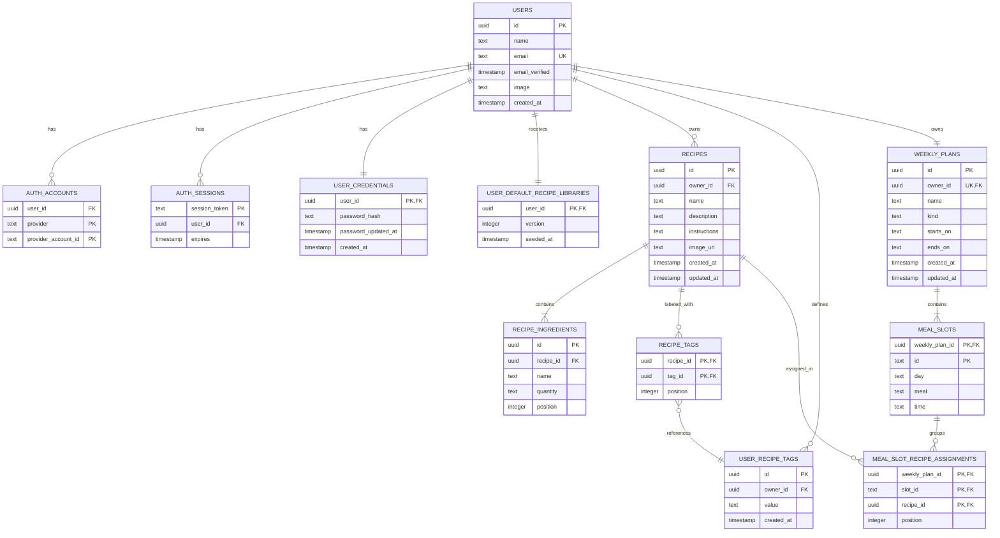

# Data model and contracts

The production schema is defined in [src/server/infrastructure/database/schema.ts](../src/server/infrastructure/database/schema.ts) and materialized through the migrations in [drizzle](../drizzle). The domain types continue to represent a user aggregate so that use cases remain independent from SQL.

## Relational diagram



## Authentication tables

The local phase uses Auth.js Credentials and these tables:

| Table | Main fields | Usage |
| --- | --- | --- |
| `users` | `id`, `name`, `email`, `email_verified`, `image`, `created_at` | Account created by the sign-up form. `id` is the owner of the Nutribro data. |
| `user_credentials` | `user_id`, `password_hash`, `password_updated_at`, `created_at` | One-to-one relationship with the local account. It only contains an Argon2id hash, never a raw password. |
| `user_default_recipe_libraries` | `user_id`, `version`, `seeded_at` | Marks the initial library version already copied to avoid duplicates in an existing account. |
| `auth_accounts` | `user_id`, `provider`, `provider_account_id`, OAuth tokens | Reserved for linking OAuth in a later phase. The primary key is `(provider, provider_account_id)`. |
| `auth_sessions` | `session_token`, `user_id`, `expires` | Prepared for a future database-backed session strategy; the local phase uses JWTs. |
| `auth_verification_tokens` | `identifier`, `token`, `expires` | Reserved for future magic links or verifications. |

Hashes, passwords, and tokens are not included in DTOs, client components, or product API responses.

## Product tables

### `recipes`

| Field | Rule |
| --- | --- |
| `id` | Global recipe UUID. |
| `owner_id` | FK to `users.id`; cascade deletes with the account. |
| `name` | Required; the domain limits it to 120 characters. |
| `description` | Optional text; maximum 600 characters in the API. |
| `instructions` | Required; maximum 8,000 characters in the API. |
| `image_url` | Nullable HTTPS URL; validated with Zod. |
| `created_at`, `updated_at` | Audit and ordering. |

The `(owner_id, updated_at)` index resolves the recipe library for an account.

### `user_recipe_tags` and `recipe_tags`

| Field | Rule |
| --- | --- |
| `id` | Tag UUID created once per unique user value. |
| `owner_id` | FK to `users.id`; a tag namespace is user-specific. |
| `value` | User-managed tag text, trimmed and deduplicated case-insensitively. |
| `created_at` | Audit field. |

Each tag value is stored exactly once per user and then reused across recipes by the `recipe_tags` join table. This keeps tags searchable and editable without creating a global default taxonomy.

| Field | Rule |
| --- | --- |
| `recipe_id` | FK to `recipes`; recipe deletion cascades the assignments. |
| `tag_id` | FK to `user_recipe_tags`. |
| `position` | Stable ordering of tags inside a recipe. |

### `recipe_ingredients`

| Field | Rule |
| --- | --- |
| `id` | Ingredient UUID. |
| `recipe_id` | FK to the recipe with cascade delete. |
| `name` | Required, maximum 120 characters in the API. |
| `quantity` | Free-form text up to 48 characters. |
| `position` | Stable presentation order. |

The quantity remains text so the system does not pretend to normalize or calculate nutrition values.

### `weekly_plans`

| Field | Rule |
| --- | --- |
| `id` | Weekly menu UUID. |
| `owner_id` | Unique FK to `users.id`: exactly one recurring menu per account in this MVP. |
| `name` | Visible menu name. |
| `kind` | Currently only `repeating`. |
| `starts_on`, `ends_on` | Nullable text reserved for future validity periods. |
| `created_at`, `updated_at` | Audit fields. |

On the first authenticated access, an empty menu and its 35 slots are created. Demo content is not shared across accounts.

### `meal_slots`

| Field | Rule |
| --- | --- |
| `weekly_plan_id`, `id` | Composite primary key. `id` has the form `monday-breakfast`. |
| `day`, `meal` | Values from the domain enums. |
| `time` | Optional textual schedule, informational only. |

In addition to the primary key, a unique index on `(weekly_plan_id, day, meal)` prevents a plan from having two breakfasts on the same day.

### `meal_slot_recipe_assignments`

| Field | Rule |
| --- | --- |
| `weekly_plan_id`, `slot_id`, `recipe_id` | Composite primary key. The same recipe may appear only once in the same slot. |
| `weekly_plan_id`, `slot_id` | Composite FK to `meal_slots`; deleting a plan or slot removes its assignments. |
| `recipe_id` | FK to `recipes`; deleting a recipe removes only its assignments. |
| `position` | Zero-based order of recipes in a slot. It is unique within `(weekly_plan_id, slot_id)`. |

The domain represents this relationship as `MealSlot.recipeIds`, a list of zero to 50 UUIDs without duplicates. The board DTO hydrates it as `MealSlotView.recipes` in the same order.

The migration `0004_gigantic_joystick` creates this table, copies each non-null `meal_slots.recipe_id` into position zero, and removes the legacy singular column after preserving the data. This keeps existing menus valid when the database is upgraded.

## Invariants and authorization

1. Every recipe, plan, account, and session is protected by foreign keys.
2. Only one recurring plan exists per user and each day/meal combination is unique per plan.
3. Each slot supports zero to 50 ordered recipes; it does not allow the same recipe twice and the position is unique within the slot.
4. Zod validation confirms that identifiers, field lengths, URLs, ingredients, and internal references all have a valid format.
5. Email and password are validated on the server; the email is normalized and only an Argon2id hash is persisted.
6. `NutritionService` filters and verifies all recipes and plans using the `userId` from the JWT session; the foreign key alone does not replace that authorization.
7. Before any mutation, the repository hydrates only the authenticated user's aggregate and revalidates domain invariants.
8. Starter library templates are copied with new UUIDs and ownership for each account. The source document provides 21 recipes with instructions; portions without a recipe are not included as recipes.

## HTTP contracts

All product responses are wrapped in one of these formats:

```ts
type ApiSuccess<T> = { data: T }
type ApiFailure = {
  error: { code: string; message: string; fields?: Record<string, string[]> }
}
```

Every route below requires an Auth.js session. Without a session they respond with `401`; if required infrastructure variables are missing they respond with `503`.

| Method | Route | Input | Output |
| --- | --- | --- | --- |
| `GET` | `/api/dashboard` | — | Enriched plan, recipes, and metrics. |
| `GET` | `/api/recipes` | — | List of recipe summaries. |
| `POST` | `/api/recipes` | `RecipeInput` | Created recipe details. |
| `GET` | `/api/recipes/:recipeId` | Path UUID | Recipe details and the slots where it is used. |
| `PATCH` | `/api/recipes/:recipeId` | `RecipeInput` | Updated recipe details. |
| `DELETE` | `/api/recipes/:recipeId` | Path UUID | Deleted ID and number of cleaned assignments. |
| `PATCH` | `/api/weekly-plan/slots/:slotId` | `{ recipeIds: UUID[] }` with zero to 50 elements | Updated dashboard. Replaces the entire selection and preserves order. |
| `GET`, `POST` | `/api/auth/[...nextauth]` | Auth.js protocol | Sign-in, session, and sign-out flows. |

## Legacy data import

[data/demo-nutrition-data.json](../data/demo-nutrition-data.json) and the historical active JSON are only import sources. The versioned demo uses `recipeIds`; legacy files with `recipeId` are normalized to a single-item list before import. `scripts/import-json.ts` validates the structure, requires a destination user UUID, and remaps recipe and ingredient UUIDs before writing to PostgreSQL. There is no automatic copy on startup.

## Preparation for future tables

| Need | Suggested new entities | Migration note |
| --- | --- | --- |
| Nutrition | `food_item`, `food_nutrition`, `recipe_ingredient_amount` | Keep the current quantity as text for compatibility. |
| Goals | `user_goal`, `nutrition_target`, `body_measurement` | Relate by user and validity range. |
| Variable plans | `weekly_plan_period`, `plan_slot_override` | Resolve the dated override first and then the base repeating plan. |
| Shopping | `shopping_list`, `shopping_list_item` | Generate from `meal_slot_recipe_assignments` and normalized amounts. |
| Shared spaces | `workspace`, `membership`, `role` | Preserve `owner_id` and add explicit per-space policies. |
