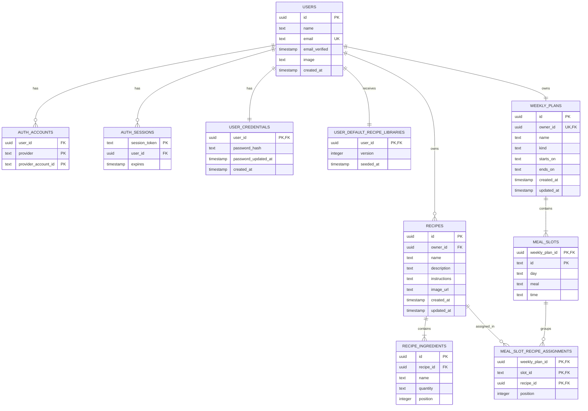

# Modelo de datos y contratos

El esquema de producción está definido en [src/server/infrastructure/database/schema.ts](../src/server/infrastructure/database/schema.ts) y se materializa mediante las migraciones de [drizzle](../drizzle). Los tipos de dominio siguen representando un agregado de usuario para mantener los casos de uso independientes de SQL.

## Diagrama relacional



## Tablas de autenticación

La fase local usa Auth.js Credentials y estas tablas:

| Tabla | Campos principales | Uso |
| --- | --- | --- |
| `users` | `id`, `name`, `email`, `email_verified`, `image`, `created_at` | Cuenta creada por el formulario de registro. `id` es el propietario de los datos de Nutribro. |
| `user_credentials` | `user_id`, `password_hash`, `password_updated_at`, `created_at` | Relación uno a uno con la cuenta local. Solo contiene un hash Argon2id, nunca una contraseña. |
| `user_default_recipe_libraries` | `user_id`, `version`, `seeded_at` | Marca la versión de biblioteca inicial ya copiada para evitar duplicados en una cuenta existente. |
| `auth_accounts` | `user_id`, `provider`, `provider_account_id`, tokens OAuth | Reservada para vincular OAuth en una fase posterior. La clave primaria es `(provider, provider_account_id)`. |
| `auth_sessions` | `session_token`, `user_id`, `expires` | Preparada para una futura estrategia de sesión de base de datos; la fase local usa JWT. |
| `auth_verification_tokens` | `identifier`, `token`, `expires` | Reservada para enlaces mágicos o verificaciones futuros. |

Los hashes, contraseñas y tokens no se incluyen en DTOs, componentes cliente ni respuestas de las API de producto.

## Tablas de producto

### `recipes`

| Campo | Regla |
| --- | --- |
| `id` | UUID global de receta. |
| `owner_id` | FK a `users.id`; borrado en cascada con la cuenta. |
| `name` | Obligatorio; el dominio limita a 120 caracteres. |
| `description` | Texto opcional; máximo 600 caracteres en la API. |
| `instructions` | Obligatorio; máximo 8.000 caracteres en la API. |
| `image_url` | URL HTTPS nullable; la validación se hace con Zod. |
| `created_at`, `updated_at` | Auditoría y ordenación. |

El índice `(owner_id, updated_at)` resuelve la biblioteca de recetas de una cuenta.

### `recipe_ingredients`

| Campo | Regla |
| --- | --- |
| `id` | UUID del ingrediente. |
| `recipe_id` | FK a la receta, con borrado en cascada. |
| `name` | Obligatorio, máximo 120 caracteres en la API. |
| `quantity` | Texto libre de hasta 48 caracteres. |
| `position` | Orden estable de presentación. |

La cantidad continúa siendo texto para no fingir normalización ni cálculos nutricionales.

### `weekly_plans`

| Campo | Regla |
| --- | --- |
| `id` | UUID del menú. |
| `owner_id` | FK única a `users.id`: exactamente un menú recurrente por cuenta en este MVP. |
| `name` | Nombre visible del menú. |
| `kind` | Actualmente solo `repeating`. |
| `starts_on`, `ends_on` | Texto nullable reservado para futuras vigencias. |
| `created_at`, `updated_at` | Auditoría. |

Al primer acceso autenticado se crea un menú vacío y sus 35 huecos. No se comparte contenido demo entre cuentas.

### `meal_slots`

| Campo | Regla |
| --- | --- |
| `weekly_plan_id`, `id` | Clave primaria compuesta. `id` tiene la forma `monday-breakfast`. |
| `day`, `meal` | Valores de los enums de dominio. |
| `time` | Horario textual nullable, solo informativo. |

Además de la clave primaria, un índice único sobre `(weekly_plan_id, day, meal)` impide que un plan tenga dos desayunos del mismo día.

### `meal_slot_recipe_assignments`

| Campo | Regla |
| --- | --- |
| `weekly_plan_id`, `slot_id`, `recipe_id` | Clave primaria compuesta. Una misma receta solo puede aparecer una vez en el mismo hueco. |
| `weekly_plan_id`, `slot_id` | FK compuesta a `meal_slots`; al borrar un plan o hueco, se eliminan sus asignaciones. |
| `recipe_id` | FK a `recipes`; al borrar una receta se eliminan únicamente sus asignaciones. |
| `position` | Orden basado en cero de las recetas del hueco. Es único dentro de `(weekly_plan_id, slot_id)`. |

El dominio representa esta relación como `MealSlot.recipeIds`, una lista de cero a 50 UUIDs sin duplicados. El DTO del tablero la hidrata como `MealSlotView.recipes` en ese mismo orden.

La migración `0004_gigantic_joystick` crea esta tabla, copia cada `meal_slots.recipe_id` no nulo a posición cero y elimina la columna singular heredada. Así, los menús existentes conservan sus recetas al actualizar la base de datos.

## Invariantes y autorización

1. Toda receta, plan, cuenta y sesión queda protegida por claves foráneas.
2. Solo existe un plan recurrente por usuario y cada combinación de día/comida es única por plan.
3. Cada hueco admite de cero a 50 recetas ordenadas; no permite repetir la misma receta y la posición es única dentro del hueco.
4. La validación Zod confirma que identificadores, longitud de campos, URL, ingredientes y referencias internas tienen una forma válida.
5. Email y contraseña se validan en servidor; el email se normaliza y solo se persiste un hash Argon2id.
6. `NutritionService` filtra y verifica todas las recetas y planes por el `userId` procedente de la sesión JWT; la clave foránea por sí sola no sustituye esa autorización.
7. Antes de una mutación, el repositorio hidrata solamente el agregado del usuario autenticado y vuelve a validar las invariantes de dominio.
8. Las plantillas de la biblioteca inicial se copian con UUID y propiedad nuevos para cada cuenta. El documento fuente aporta 21 recetas con elaboración; las porciones sin receta no se incluyen como recetas.

## Contratos HTTP

Todas las respuestas de producto se envuelven en uno de estos formatos:

```ts
type ApiSuccess<T> = { data: T }
type ApiFailure = {
  error: { code: string; message: string; fields?: Record<string, string[]> }
}
```

Todas las rutas siguientes requieren sesión Auth.js. Sin sesión responden `401`; si faltan variables de infraestructura responden `503`.

| Método | Ruta | Entrada | Salida |
| --- | --- | --- | --- |
| `GET` | `/api/dashboard` | — | Plan enriquecido, recetas y métricas. |
| `GET` | `/api/recipes` | — | Lista de resúmenes de receta. |
| `POST` | `/api/recipes` | `RecipeInput` | Detalle de la receta creada. |
| `GET` | `/api/recipes/:recipeId` | UUID de ruta | Detalle y huecos donde se usa. |
| `PATCH` | `/api/recipes/:recipeId` | `RecipeInput` | Detalle actualizado. |
| `DELETE` | `/api/recipes/:recipeId` | UUID de ruta | ID eliminado y número de asignaciones limpiadas. |
| `PATCH` | `/api/weekly-plan/slots/:slotId` | `{ recipeIds: UUID[] }` único, de cero a 50 elementos | Dashboard actualizado. Reemplaza la selección completa y conserva su orden. |
| `GET`, `POST` | `/api/auth/[...nextauth]` | Protocolo Auth.js | Inicio de sesión, sesión y cierre de sesión. |

## Importación de datos heredados

[data/demo-nutrition-data.json](../data/demo-nutrition-data.json) y el JSON activo histórico solo son fuentes de importación. El demo versionado usa `recipeIds`; los ficheros heredados con `recipeId` se normalizan a una lista de un elemento antes de importar. `scripts/import-json.ts` valida su estructura, exige un UUID de usuario destino y remapea los UUID de recetas e ingredientes antes de escribir en PostgreSQL. No hay copia automática al arrancar.

## Preparación para futuras tablas

| Necesidad | Entidades nuevas sugeridas | Nota de migración |
| --- | --- | --- |
| Nutrición | `food_item`, `food_nutrition`, `recipe_ingredient_amount` | Mantener la cantidad actual como texto de compatibilidad. |
| Objetivos | `user_goal`, `nutrition_target`, `body_measurement` | Relacionar por usuario y rango de vigencia. |
| Planes variables | `weekly_plan_period`, `plan_slot_override` | Resolver primero un override con fecha y después el plan recurrente. |
| Compra | `shopping_list`, `shopping_list_item` | Generar desde `meal_slot_recipe_assignments` y cantidades normalizadas. |
| Espacios compartidos | `workspace`, `membership`, `role` | Conservar `owner_id` y añadir políticas explícitas por espacio. |
